# WEB SOLUTION WITH WORDPRESS

## In this project we will prepare storage infrastructure on two Linux servers and implement a basic web solution using WordPress 

### THIS PROJECT CONSISTS OF TWO PARTS

1. Configure storage subsystem for Web and Database servers based on Linux OS. 

2. Install WordPress and connect it to a remote MySQL database server.

### Prepare a Web Server

1. Launch an EC2 instance that will serve as “Web Server”. Create 3 volumes in the same availability zone as your Web Server EC2, each of 10 GiB

2. Attach all three volumes one by one to your Web Server EC2 instance

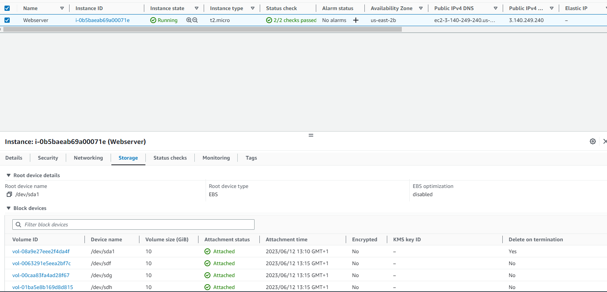

3. Open up the Linux terminal to begin configuration

4. Use lsblk command to inspect what block devices are attached to the server

5. Use df -h command to see all mounts and free space on your server

6. Use gdisk utility to create a single partition on each of the 3 disks

$ `sudo gdisk /dev/xvdf`

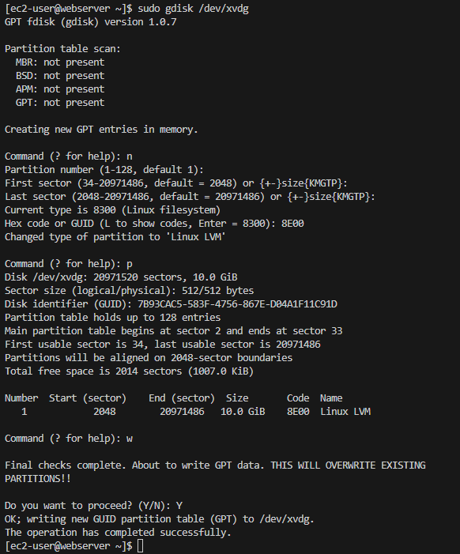

7. Use lsblk utility to view the newly configured partition on each of the 3 disks

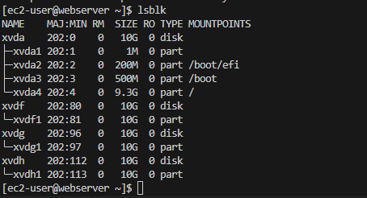

8. Install lvm2 package using sudo yum install lvm2. Run sudo lvmdiskscan command to check for available partitions

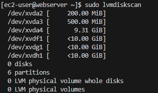

9. Use pvcreate utility to mark each of 3 disks as physical volumes (PVs) to be used by LVM

$ `sudo pvcreate /dev/xvdf1`

$ `sudo pvcreate /dev/xvdg1`

$ `sudo pvcreate /dev/xvdh1`

10. Verify that your Physical volume has been created successfully by running sudo pvs

11. Use vgcreate utility to add all 3 PVs to a volume group (VG). Name the VG webdata-vg

$ `sudo vgcreate webdata-vg /dev/xvdh1 /dev/xvdg1 /dev/xvdf1`

12. Verify that your VG has been created successfully by running sudo vgs

13. Use lvcreate utility to create 2 logical volumes. apps-lv (Use half of the PV size), and logs-lv Use the remaining space of the PV size. NOTE: apps-lv will be used to store data for the Website while, logs-lv will be used to store data for logs.

$ `sudo lvcreate -n apps-lv -L 14G webdata-vg`

$ `sudo lvcreate -n logs-lv -L 14G webdata-vg`

14. Verify that your Logical Volume has been created successfully by running sudo lvs

Verify the entire setup

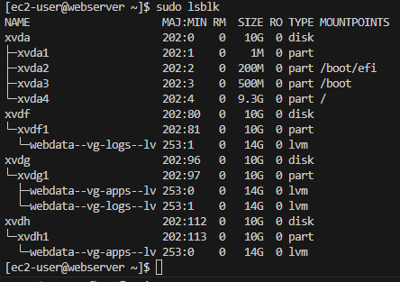

## Format the logial volumes

 Use mkfs.ext4 to format the logical volumes with ext4 filesystem

$ `sudo mkfs -t ext4 /dev/webdata-vg/apps-lv`

$ `sudo mkfs -t ext4 /dev/webdata-vg/logs-lv`

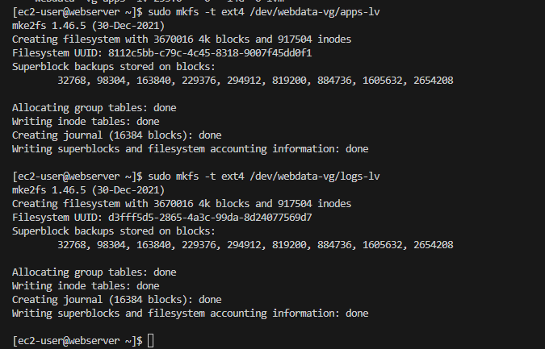

15. Create /var/www/html directory to store website files

$ `sudo mkdir -p /var/www/html`

16. Create /home/recovery/logs to store backup of log data

$ `sudo mkdir -p /home/recovery/logs`

17. Mount /var/www/html on apps-lv logical volume

$ `sudo mount /dev/webdata-vg/apps-lv /var/www/html/`

18. Use rsync utility to backup all the files in the log directory /var/log into /home/recovery/logs (This is required before mounting the file system)

$ `sudo rsync -av /var/log/. /home/recovery/logs/`

19. Mount /var/log on logs-lv logical volume. (Note that all the existing data on /var/log will be deleted. That is why step 18 above is very important)

$ `sudo mount /dev/webdata-vg/logs-lv /var/log`

20. Restore log files back into /var/log directory

$ `sudo rsync -av /home/recovery/logs/log/. /var/log`

21. Update /etc/fstab file so that the mount configuration will persist after restart of the server.

The UUID of the device will be used to update the /etc/fstab file;

$ `sudo vi /etc/fstab`

Update /etc/fstab in this format using your own UUID and rememeber to remove the leading and ending quotes.

22. Test the configuration and reload the daemon

$ `sudo mount -a`

$ `sudo systemctl daemon-reload`

Verify your setup by running `df -h`, output must look like this:

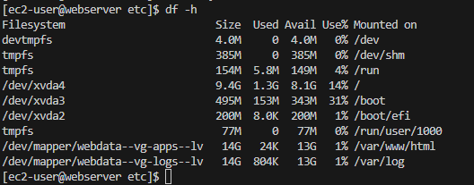

## PREPARE THE DATABASE SERVER

Launch a second RedHat EC2 instance that will have a role – ‘DB Server’
Repeat the same steps as for the Web Server, but instead of apps-lv create db-lv and mount it to /db directory instead of /var/www/html/.

## Install WordPress on your Web Server EC2

1. Update the repository

$ `sudo yum -y update`

2. Install wget, Apache and it’s dependencies

$ `sudo yum -y install wget httpd php php-mysqlnd php-fpm php-json`

3. Start Apache

$ `sudo systemctl enable httpd`

$ `sudo systemctl start httpd`

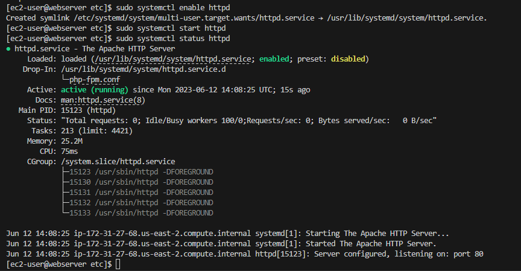

4. To install PHP and it’s depemdencies

$ `sudo yum install https://dl.fedoraproject.org/pub/epel/epel-release-latest-8.noarch.rpm`

$ `sudo yum install yum-utils http://rpms.remirepo.net/enterprise/remi-release-8.rpm`

$ `sudo yum module list php`

$ `sudo yum module reset php`

$ `sudo yum module enable php:remi-7.4`

$ `sudo yum install php php-opcache php-gd php-curl php-mysqlnd`

$ `sudo systemctl start php-fpm`

$ `sudo systemctl enable php-fpm`

$ `setsebool -P httpd_execmem 1`

5. Restart Apache

$ `sudo systemctl restart httpd`

6. Download wordpress and copy wordpress to var/www/html

  $ `mkdir wordpress`

  $ `cd   wordpress`

  $ `sudo wget http://wordpress.org/latest.tar.gz`

  $ `sudo tar xzvf latest.tar.gz`

  $ `sudo rm -rf latest.tar.gz`

  $ `cp wordpress/wp-config-sample.php wordpress/wp-config.php`

  $ `cp -R wordpress /var/www/html/`

7. Configure SELinux Policies

  $ `sudo chown -R apache:apache /var/www/html/wordpress`

  $ `sudo chcon -t httpd_sys_rw_content_t /var/www/html/wordpress -R`

  $ `sudo setsebool -P httpd_can_network_connect=1`

## Install MySQL on your DB Server EC2

$ `sudo yum update`

$ `sudo yum install mysql-server`

Verify that the service is up and running by running the following command

$ `sudo systemctl status mysqld`

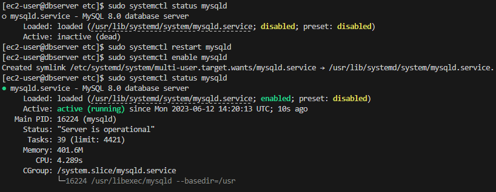

If it is not running, restart the service and enable it so it will be running even after reboot

$ `sudo systemctl restart mysqld`

$ `sudo systemctl enable mysqld`

## Configure DB to work with WordPress

$ `sudo mysql`

mysql > `CREATE DATABASE wordpress;`

mysql > `CREATE USER `myuser`@`<Web-Server-Private-IP-Address>` IDENTIFIED BY 'mypass';` 

 mysql > `GRANT ALL ON wordpress.* TO 'myuser'@'<Web-Server-Private-IP-Address>';` 

mysql > `FLUSH PRIVILEGES;`

mysql > `SHOW DATABASES;`

mysql > exit

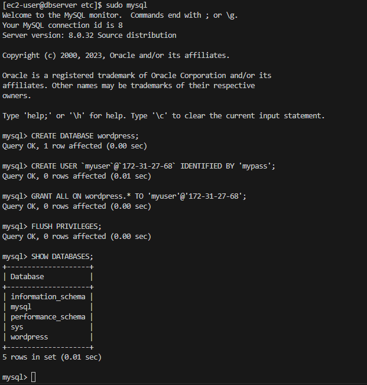
## Configure WordPress to connect to remote database

1. Open MySQL port 3306 on DB Server EC2 and allow connection only from web server's IP address.

2. Install MySQL client and test that you can connect from your Web Server to your DB server by using mysql-client

`sudo yum install mysql`

`sudo mysql -u admin -p -h <DB-Server-Private-IP-address>`

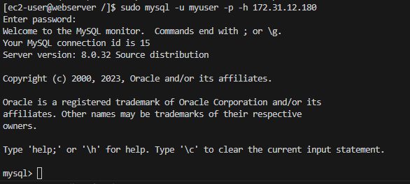

3. Verify if you can successfully execute SHOW DATABASES; command and see a list of existing databases.

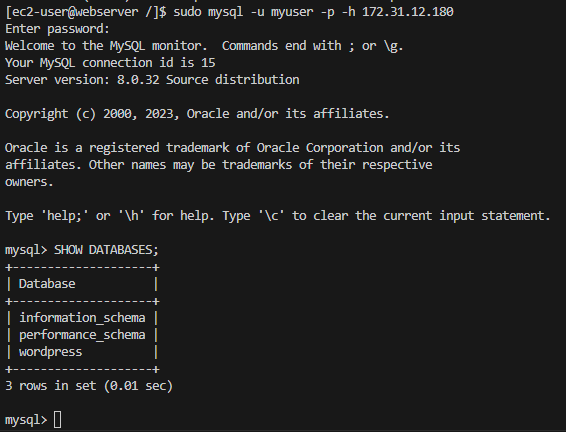

4. Change permissions and configuration so Apache could use WordPress:

5. Enable TCP port 80 in Inbound Rules configuration for your Web Server EC2 (enable from everywhere 0.0.0.0/0 or from your workstation’s IP)

6. Try to access from your browser the link to your WordPress http://<Web-Server-Public-IP-Address>/wordpress/
